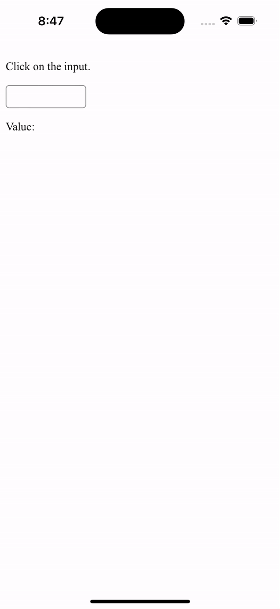

# Year Month Picker Plugin

It is 2024, but Safari on iOS still does
[not support](https://caniuse.com/input-datetime) the `min` and `max` attributes
on the `input[type="month"]` element.
This project provides a custom picker for year and month selection on iOS.



## Installation

```shell
npm install @oliveryasuna/cmi-year-month-picker-plugin
npx cap sync
```

## Example

```typescript
import {YearMonthPicker} from '@oliveryasuna/cmi-year-month-picker-plugin';

//...in some function
YearMonthPicker.showYearMonthPicker({
  value: '2024-09',
  min: '2024-01',
  max: '2024-12'
}).then(({value}) => {
  console.log(value);
});
```

## Configuration

| Property                    | Type                              | Description                                             | Default                      | Since |
|-----------------------------|-----------------------------------|---------------------------------------------------------|------------------------------|-------|
| **`title`**                 | <code>string</code>               | The title of the picker container                       | <code>'Select a date'</code> | 1.0.0 |
| **`pickerStyle`**           | <code>'inline' \| 'wheels'</code> | The style of the picker.                                | <code>'wheels'</code>        | 1.0.0 |
| **`doneButtonLabel`**       | <code>string</code>               | The label of the done button.                           | <code>'Done'</code>          | 1.0.0 |
| **`cancelButtonLabel`**     | <code>string</code>               | The label of the cancel button.                         | <code>'Cancel'</code>        | 1.0.0 |
| **`theme`**                 | <code>'light' \| 'dark'</code>    | The theme color.                                        |                              | 1.0.0 |
| **`forceTheme`**            | <code>boolean</code>              | Force the specified theme, overriding the system theme. | <code>false</code>           | 1.0.0 |
| **`titleFontColor`**        | <code>`#${string}`</code>         | The title font color.                                   |                              | 1.0.0 |
| **`titleBackgroundColor`**  | <code>`#${string}`</code>         | The title background color.                             |                              | 1.0.0 |
| **`fontColor`**             | <code>`#${string}`</code>         | The font color.                                         |                              | 1.0.0 |
| **`backgroundColor`**       | <code>`#${string}`</code>         | The background color.                                   |                              | 1.0.0 |
| **`buttonFontColor`**       | <code>`#${string}`</code>         | The button font color.                                  |                              | 1.0.0 |
| **`buttonBackgroundColor`** | <code>`#${string}`</code>         | The button background color.                            |                              | 1.0.0 |

### Examples

In `capacitor.config.json`:

```json
{
  "plugins": {
    "YearMonthPicker": {
      "theme": "light",
      "title": "Select a month and year",
      "pickerStyle": "wheels",
      "doneButtonLabel": "OK",
      "cancelButtonLabel": "Cancel"
    }
  }
}
```

In `capacitor.config.ts`:

```typescript
/// <reference types="@oliveryasuna/cmi-year-month-picker-plugin" />

import {CapacitorConfig} from '@capacitor/cli';

const config: CapacitorConfig = {
  plugins: {
    YearMonthPicker: {
      theme: 'light',
      title: 'Select a month and year',
      pickerStyle: 'wheels',
      doneButtonLabel: 'OK',
      cancelButtonLabel: 'Cancel'
    }
  }
};

export default config;
```

## API

* [`showYearMonthPicker(...)`](#showyearmonthpicker)
* [Interfaces](#interfaces)

### showYearMonthPicker(...)

```typescript
showYearMonthPicker(options?: ShowYearMonthPickerOptions): Promise<ShowYearMonthPickerResult>;
```

Show the year and month picker.

| Parameter     | Type                                                                              |
|---------------|-----------------------------------------------------------------------------------|
| **`options`** | <code><a href="#showyearmonthpickeroptions">ShowYearMonthPickerOptions</a></code> |

**Returns:** <code>Promise&lt;<a href="#showyearmonthpickerresult">ShowYearMonthPickerResult</a>&gt;</code>

**Since:** 1.0.0

### Interfaces

#### ShowYearMonthPickerOptions

| Property                    | Type                              | Description                                             | Default                      | Since |
|-----------------------------|-----------------------------------|---------------------------------------------------------|------------------------------|-------|
| **`value`**                 | <code>string</code>               | The initial value, in the format `yyyy-MM`              |                              | 1.0.0 |
| **`min`**                   | <code>string</code>               | The minimum value, in the format `yyyy-MM`              |                              | 1.0.0 |
| **`max`**                   | <code>string</code>               | The maximum value, in the format `yyyy-MM`              |                              | 1.0.0 |
| **`title`**                 | <code>string</code>               | The title of the picker container.                      | <code>'Select a date'</code> | 1.0.0 |
| **`pickerStyle`**           | <code>'inline' \| 'wheels'</code> | The style of the picker.                                | <code>'wheels'</code>        | 1.0.0 |
| **`doneButtonLabel`**       | <code>string</code>               | The label of the done button.                           | <code>'Done'</code>          | 1.0.0 |
| **`cancelButtonLabel`**     | <code>string</code>               | The label of the cancel button.                         | <code>'Cancel'</code>        | 1.0.0 |
| **`theme`**                 | <code>'light' \| 'dark'</code>    | The theme color.                                        |                              | 1.0.0 |
| **`forceTheme`**            | <code>boolean</code>              | Force the specified theme, overriding the system theme. | <code>false</code>           | 1.0.0 |
| **`titleFontColor`**        | <code>`#${string}`</code>         | The title font color.                                   |                              | 1.0.0 |
| **`titleBackgroundColor`**  | <code>`#${string}`</code>         | The title background color.                             |                              | 1.0.0 |
| **`fontColor`**             | <code>`#${string}`</code>         | The font color.                                         |                              | 1.0.0 |
| **`backgroundColor`**       | <code>`#${string}`</code>         | The background color.                                   |                              | 1.0.0 |
| **`buttonFontColor`**       | <code>`#${string}`</code>         | The button font color.                                  |                              | 1.0.0 |
| **`buttonBackgroundColor`** | <code>`#${string}`</code>         | The button background color.                            |                              | 1.0.0 |

#### ShowYearMonthPickerResult

| Property    | Type                        | Description                                                          | Since |
|-------------|-----------------------------|----------------------------------------------------------------------|-------|
| **`value`** | <code>string \| null</code> | The selected value, in the format `yyyy-MM`, or `null` if cancelled. | 1.0.0 |
